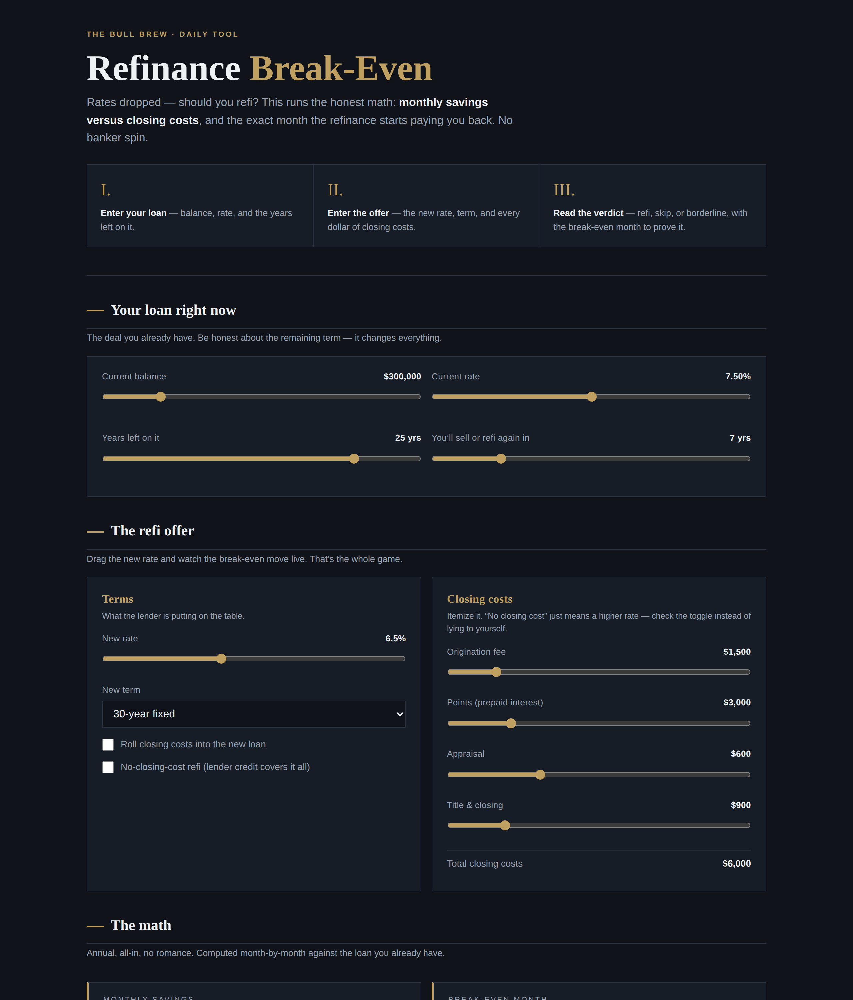

# Refinance Break-Even

**Live:** https://thebullbrew.github.io/refinance-break-even/

Rates dropped — should you refi? This watcher runs the honest break-even math: monthly savings versus every dollar of closing costs, and the exact month the refinance starts paying you back. No banker spin.

## The method

Most refi advice stops at "lower rate = good." That's how lenders sell you points you'll never outlive. This tool compares two full paths month-by-month:

1. **Stay the course** — your current balance, rate, and remaining term.
2. **Take the offer** — new rate, new term, itemized closing costs.

The verdict comes from your *horizon* — how long you'll actually keep the loan. A refi that breaks even in month 40 is a donation if you sell in month 36.

- **Monthly savings** — old payment vs. new payment, big and unavoidable.
- **Break-even month** — solved exactly: the first month the refi's cumulative benefit turns positive (wealth-based, so shorter terms are handled honestly).
- **Net benefit over your horizon** — total interest + costs on each path, over the years you'll actually keep the loan.
- **Verdict: REFI / SKIP / BORDERLINE** — plain-English reasoning, including the "you'd sell before it pays back" trap.
- **Watches** — save offers as rates move and compare them side by side.

It also explains **points vs. lender credits** in plain English, because "no-closing-cost refi" just means a higher rate.

## How to run

No build, no backend. Open `docs/index.html` in any browser — or install it as a PWA (manifest + service worker included, works offline). Everything is computed client-side; nothing leaves your device.

Estimates only, not financial advice.
